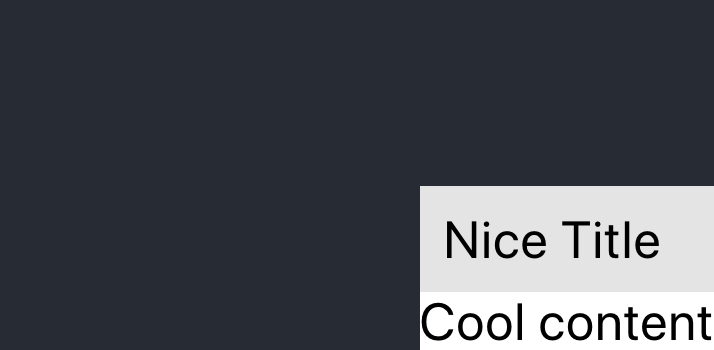
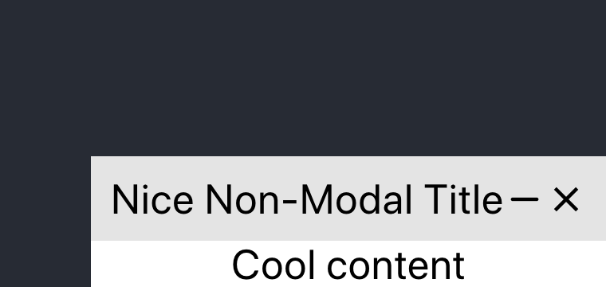
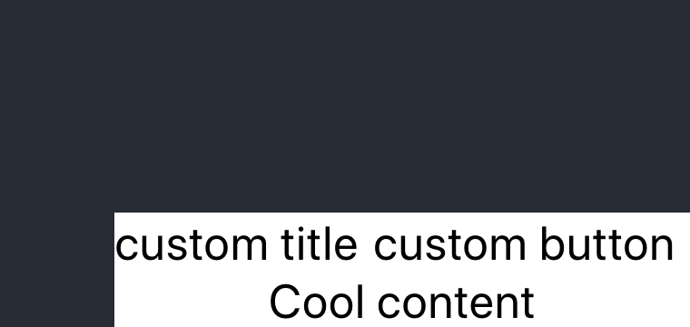

Simple Usage:
```jsx
<NonModalWindow
  open={open}
  minimized={minimized}
  title="Nice Title"
  content="Cool content"
  position="bottom"
  align="right"
  dragProps={{
    bounds: 'parent',
    axis: 'x',
  }}
/>
```
Simple usage result:



Controlled with Icons

```jsx
<NonModalWindow
  open={open}
  toggleOpen={toggleOpen}
  minimized={minimized}
  toggleMinimized={toggleMinimized}
  minimizeIcon={<FiMinus />}
  maximizeIcon={<FiMinus />}
  closeIcon={<MdClose />}
  title="Nice Non-Modal Title"
  content="Cool content"
  position="bottom"
  align="right"
  dragProps={{
    bounds: 'parent',
    axis: 'x',
  }}
/>
```

Controlled Non-Modal result:



Custom Header

```jsx
<NonModalWindow
  open={open}
  minimized={minimized}
  content="Cool content"
  position="bottom"
  align="right"
  dragProps={{
    bounds: 'parent',
    axis: 'x',
  }}
  header={<CustomHeader />}
/>
```
Custom Header result:


